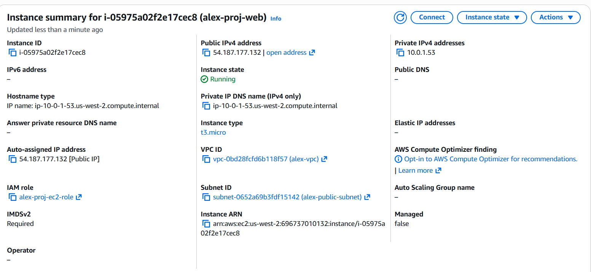
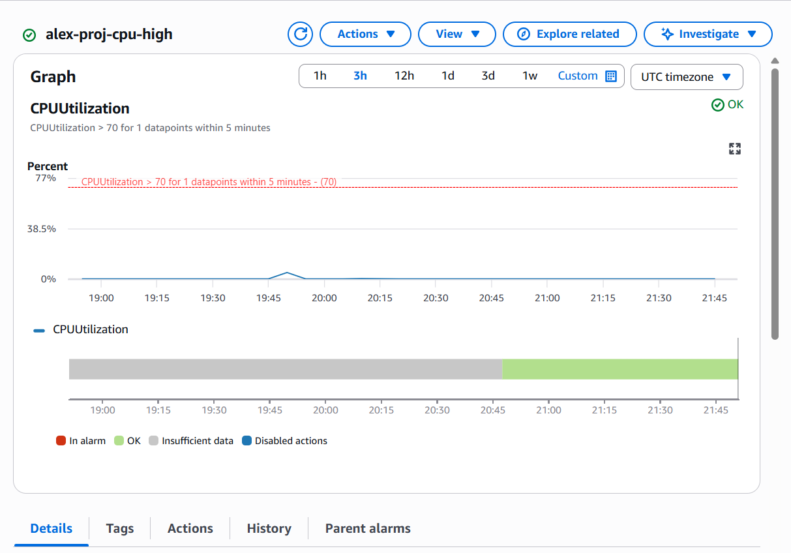
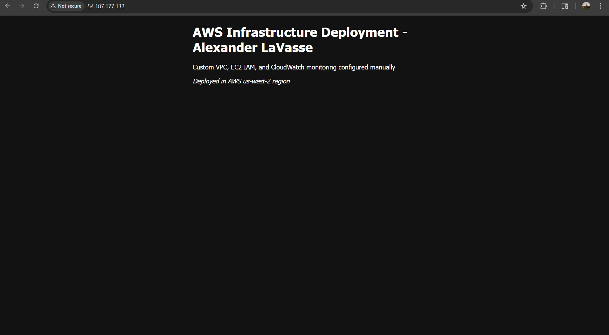

# Secure AWS EC2 Deployment with Custom Networking & Monitoring

## Project Overview
This project demonstrates manual deployment of cloud infrastructure using AWS.  
A custom VPC, public subnet, EC2 instance, security group configuration, IAM role attachment, and CloudWatch monitoring were configured without automation tools.

## Architecture Components
- Custom VPC (10.0.0.0/16)  
- Public Subnet (10.0.1.0/24)  
- Internet Gateway and route table configuration  
- EC2 instance (t3.micro, Amazon Linux 2)  
- Security Group (SSH restricted to my IP, HTTP open to public)  
- IAM role attached to EC2 instance  
- CloudWatch CPU utilization alarm (>70%)

## Screenshots / Proof
**EC2 instance (running)**  

**Security group (inbound rules: SSH restricted, HTTP public)**  

**Route table (0.0.0.0/0 → Internet Gateway)**  

**CloudWatch alarm (CPUUtilization > 70%)**  

**Live web page (custom nginx landing page)**  

## Security & Monitoring Notes
- SSH access limited to my IP to prevent brute force attacks.  
- IAM role assigned to EC2 for CloudWatch access (no embedded credentials).  
- Monitoring via CloudWatch alarm for basic operational visibility.

## How to reproduce (high level)
1. Create custom VPC and public subnet.  
2. Create Internet Gateway and add `0.0.0.0/0` route.  
3. Launch EC2 in public subnet with a security group allowing SSH (my IP) and HTTP (0.0.0.0/0).  
4. Attach an IAM role with `CloudWatchAgentServerPolicy`.  
5. Install nginx and configure CloudWatch alarm for CPU.

---

*This demonstrates practical, hands-on knowledge of cloud networking, compute provisioning, access control, and basic monitoring—skills relevant to cloud/platform/infrastructure intern roles.*
